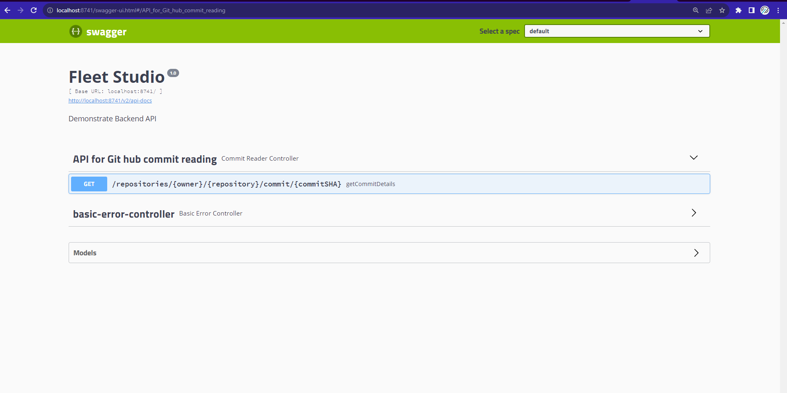
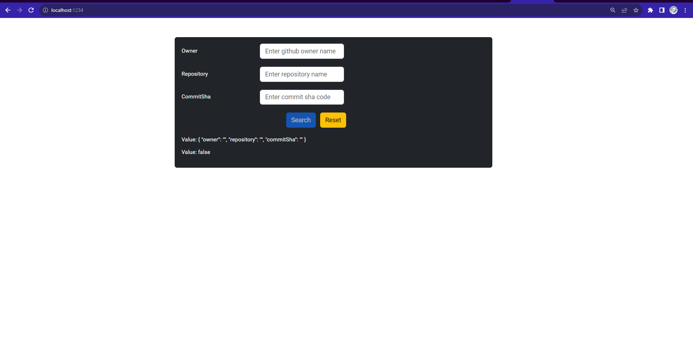
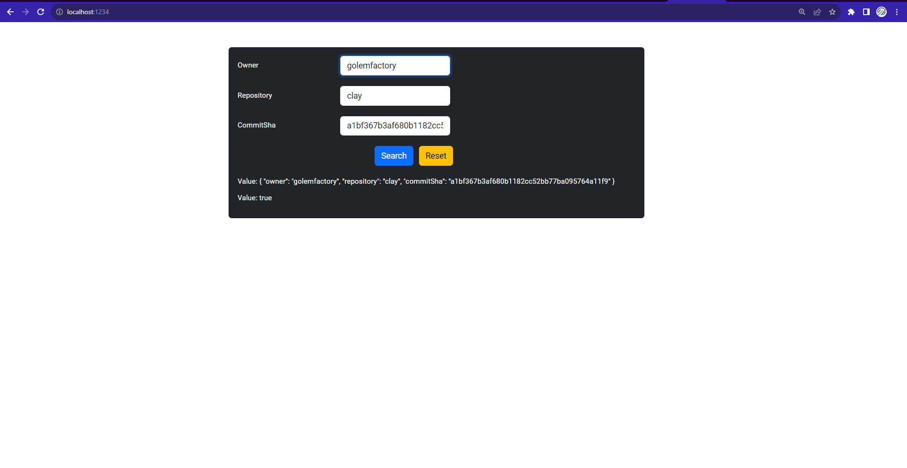
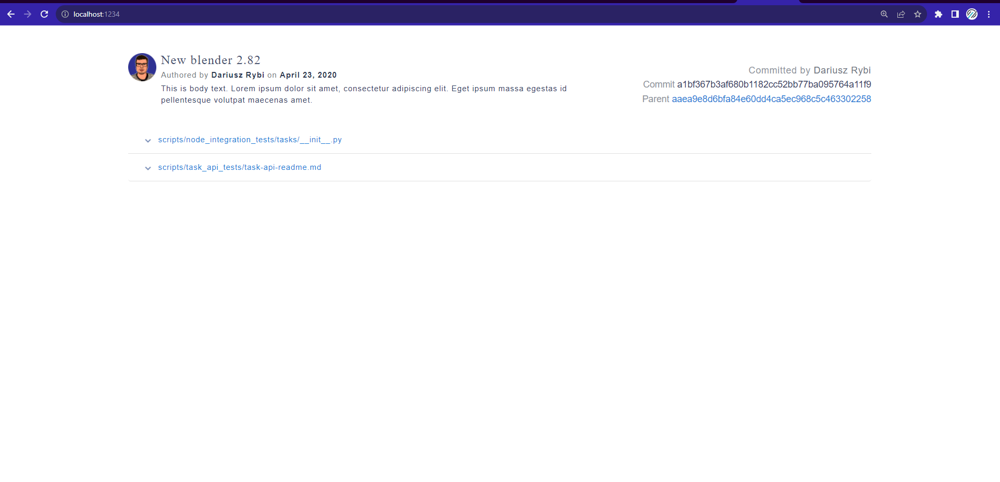
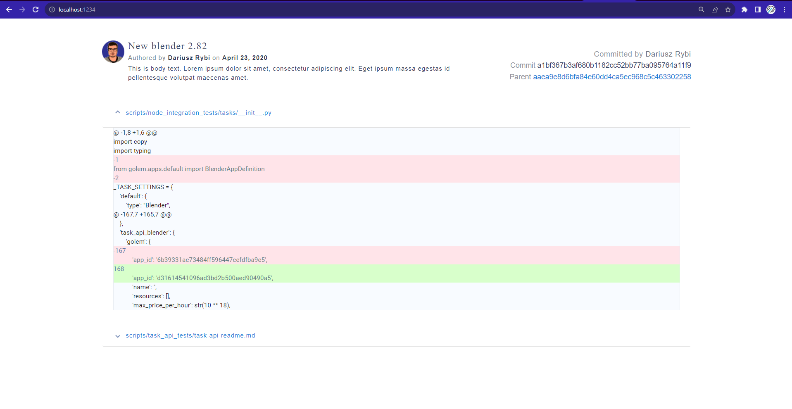
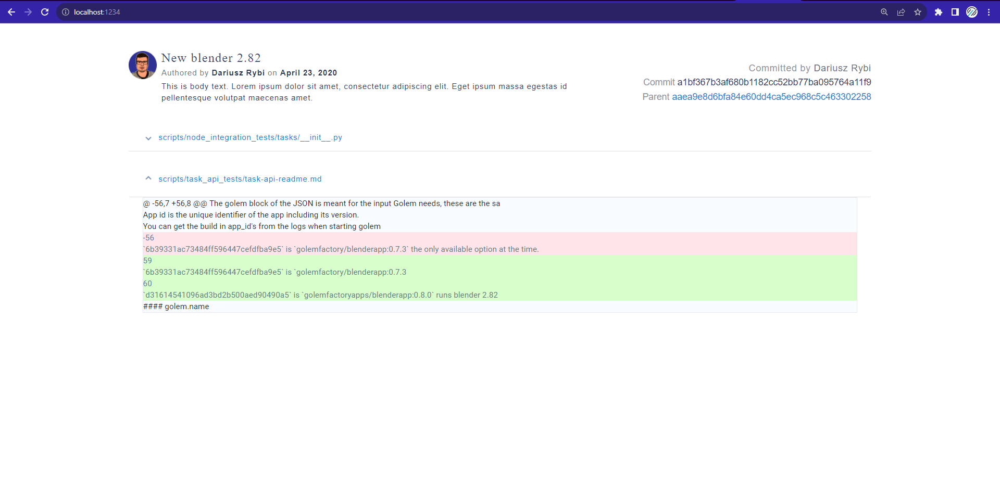
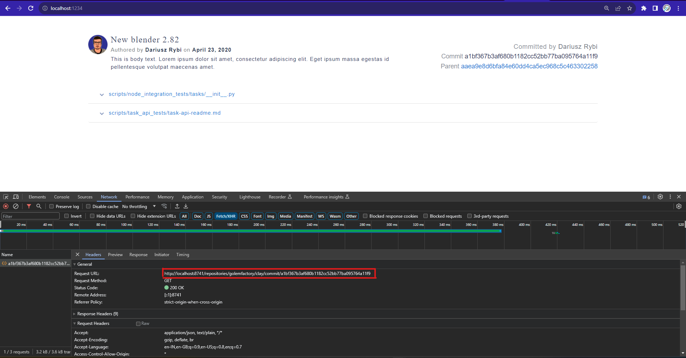

# Git Hub Commit Diff

<b>Coding exercise - Fleet Studio</b>

The project is build up on the following tech stack 
<b>Frontend: </b> HTML, CSS, Typescript, Angular, Angular-material, Bootstrap 
<b>Backend: </b> Java, Springboot, Maven 

To run the app, follow the below instruction 

# Backend:
1. Need java 11 
2. Import project to Intellij (recommended) 
3. Right click on project and choose maven -> reload (download dependency) 
4. Check java indexing is done 
5. Run the project from the main method, or from menu bar choose run menu and choose run 
6. A swagger page has been configured, once backend is up, hit this url in browser to open the swagger page. 
	http://localhost:8741/swagger-ui.html 
	
	
	
# Frontend:
1. Need node js version 14+
2. Go into the frontend project, and check whether you are into angular project. 
	git-commit-reader\Frontend\git-commit-reader-frontend 
3. Install the dependency by running this command "npm i" 
4. To run the app enter this command in terminal "npm start" 
5. To view the app go the this url http://localhost:1234/ 

Using this app user can feed owner, repo name and commit hash code and get the commit details. 
This is done for testing purpose. 
On the first page, user have to fill the form by giving owner name, repo name, commit hash of any  
public github repository. 

On clicking Search button, it will show the commit diff and other details regarding the commit. 

# Application Screenshot: 

